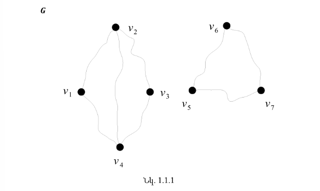
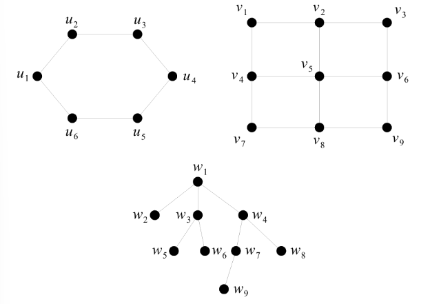
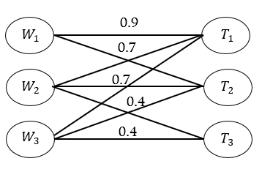
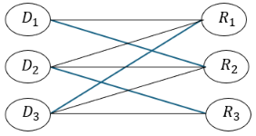
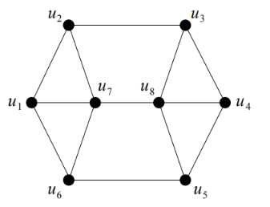

**ԳԼՈՒԽ 1․ ԱՆՀՐԱԺԵՇՏ ՏԵՂԵԿՈՒԹՅՈՒՆՆԵՐ**

**§ 1.1. Գրաֆների վերաբերյալ հիմնական տեղեկություններ**

Դիցուք  <b><i>V</i> = { 𝑣1, …, 𝑣n }</b>-ը ցանկացած ոչ դատարկ վերջավոր բազմություն է, և դիցուք 

V2*-ը* V* բազմության տարրերի բոլոր ոչ կարգավոր զույգերի բազմությունն է: Նշենք, որ **|**V2**|=**n2**:** Ենթադրենք, որ E **⊆** V2**:** 

**Սահմանում 1.1.1:** **(𝑉, 𝐸)** կարգավոր զույգին կանվանենք գրաֆ, և այն կնշանակենք **𝐺** -ով: 

`     `**𝐺 = (𝑉, 𝐸)** գրաֆի  **𝑉** բազմության տարրերին կանվանենք գրաֆի գագաթներ, իսկ **𝐸** բազմության տարրերին՝ կողեր: Եթե անհրաժեշտ է շեշտել, որ **𝑉** -ն հանդիսանում է **𝐺** գրաֆի գագաթների բազմություն, ապա այդ դեպքում մենք կգրենք **𝑉 (𝐺),**  **( 𝐸 (𝐺)):** Եթե    **e** **∈** **E**  կողը , ***u, v*  ∈** ***V*** գագաթներից բաղկացած զույգն է, ապա այդ փաստը կգրենք             **e*** = **uv*** -ով:

Դիցուկ **𝐺 = (𝑉, 𝐸)**  և **𝐺′ *=* (𝑉′, 𝐸′)**  երկու գրաֆներ են։

**Սահմանում 1. 1.2*:  𝐺*** և **𝐺′** գրաֆները կանվանենք հավասար և կգրենք **𝐺 = 𝐺′** այն և միայն այն. դեպքում,երբ **𝑉 =  𝑉′**, և  **𝐸  =  𝐸′** ։ 

Նշենք, որ գրաֆները կարելի է դիտարկել որպես հատուկ տիպի համասեռ բինար հարաբերություն, որի հենքային բազմությունը **𝑉** -ն է: Հիշենք, որ α **⊆ 𝑉 × 𝑉** բինար հարաբերությունը կոչվում է 

`    	`ռեֆլեքսիվ, եթե ցանկացած **𝑣 ∈ 𝑉**  համար **𝑣**α**𝑣**, 

`  	`անտիռեֆլեքսիվ, եթե ցանկացած **𝑣 ∈ 𝑉**   համար **𝑣**α**𝑣**, 

`  	`սիմետրիկ, եթե ցանկացած **u, 𝑣 ∈ 𝑉**   համար բավարարվում է պայմանը. եթե uα**𝑣,** ապա **𝑣**αu: 

`  `Նկատենք, որ **G = (V, E)** գրաֆը կարող ենք դիտարկել որպես α **⊆ 𝑉 × 𝑉** անտիռեֆլեքսիվ, սիմետրիկ բինար հարաբերություն, որտեղ ցանկացած **u,v** **∈** **V** համար  բավարարվում է հետևյալ պայմանը. uαv այն միայն այն դեպքում, երբ **uv ∈ E** :

Ստորեւ կդիտարկենք գրաֆների տրման մի քանի եղանակներ: Նախ նշենք, որ գրաֆը կարելի է տալ, նշելով նրա գագաթների եւ կողերի բազմությունները: Օրինակ, դիտարկենք **G = (V, E)** գրաֆը, որտեղ     V=v1, v2,v3,v4,v5,v6,v7           և               E=v1v2, v2v3,v3v4,v1v4, v2v4,v5v6,v6v7, v5 v7:**          

`   `Մեկ այլ եղանակ է գրաֆների տրման երկրաչափական եղանակը, որի էությունը կայանում է հետևյալում. գրաֆի գագաթներին համապատասխանեցնում ենք հարթության կետեր (տարբեր գագաթներին համապատասխանում են տարբեր կետեր), և երկու կետեր միացվում են անընդհատ կորով, որը չի անցնում մեկ այլ գագաթին համապատասխանող կետով` այն և միայն այն դեպքում, երբ նրանց համապատասխանող գագաթները կող են կազմում գրաֆում: Օրինակ, վերը նշված գրաֆը կարելի է պատկերել հետևյալ կերպ. 

` `

**Սահմանում 1.1.3:**  **𝐺** գրաֆը կանվանենք նշված (կամ համարակալված),  եթե այդ գրաֆի գագաթներին վերագրված են զույգ առ զույգ տարբեր նիշեր: 

Գրաֆների տրման հաջորդ եղանակները նկարագրելու համար տանք մի քանի սահմանում:

Դիցուք **𝐺 = (𝑉, 𝐸)** -ն գրաֆ է, **u, 𝑣 ∈ 𝑉**   եւ e**,** e**′ ∈ 𝐸**:\
**Սահմանում 1.1.4:** u և **𝑣** գագաթները կանվանենք հարեւան, եթե u**𝑣 ∈ 𝐸**:\
**Սահմանում 1.1.5:** u գագաթին և** e կողին կանվանենք կից, եթե** u **∈** e:\
**Սահմանում 1.1.6:** e և e**′** տարբեր կողերը կանվանենք հարեւան, եթե գոյություն ունի 

` `**𝑣 ∈ 𝑉**   այնպես, որ **𝑣** -ն կից է** e -ին եւ e **′** -ին:

Եթե <b>𝐺 = (𝑉, 𝐸)</b> գրաֆում <b>𝑉 = { 𝑣1,..., 𝑣n}</b> եւ <b>𝐸 = {</b>e1<b>,...,</b></i> em<b>},</b> ապա այդ գրաֆին 

համապատասխանեցնենք n **×** n կարգի A**(𝐺) =** aijn×nմատրիցը հետեւյալ կերպ. 
**\
`                                 `aij=1, եթե  viև  vj  հարևան են0, հակառակ դեպքում       

A**(𝐺)** մատրիցը կանվանենք **𝐺** գրաֆի հարեւանության մատրից: Նկատենք, որ 

ցանկացած i-ի համար **(1≤*** i **≤*** n**)** aii**=0**,և ցանկացած i,j -ի համար **(1≤*** i,j **≤*** n**)*** aij**=**aji։\
Նկ․ 1․1․1-ում բերված 𝐺 գրաֆի հարեւանության մատրիցը կլինի՝

**                                      A **(𝐺) =**0101000101100001010001110000000001100001010000110

Եթե <b>𝐺 = (𝑉, 𝐸)</b> գրաֆում <b>𝑉 = { 𝑣1,...,</b> vn<b>}</b>   և  <b>𝐸 = {</b>e1<b>,...,</b></i> em<b>},</b> ապա այդ գրաֆին 

համապատասխանեցնենք n **×** m կարգի B**(𝐺) =** bijn×m մատրիցը հետեւյալ կերպ. 
**\
`                                 `aij=1, եթե  viև  ejկից են           0, հակառակ դեպքում       

B**(𝐺)**  մատրիցը կանվանենք **𝐺** գրաֆի կցության  մատրից: Նկատենք, որ կցության մատրիցի սյուները զույգ առ զույգ տարբեր են և յուրաքանչյուր սյուն պարունակում է ճիշտ երկու **1**: 

**𝐺** գրաֆի կցության մատրիցը կլինի` 

**                                      A **(𝐺) =**10010000110010000110000000111000000001010000011100000011

որտեղ ենթադրված է, որ e1=v1v2,e2=v2v3, e3=v3v4,e4=v1v4,e5=v2v4,e6=v5v6,   e7=v6v7,e8=v5v7

`  `Նշենք, որ զրոներից եւ մեկերից կազմված n **×** m կարգի յուրաքանչյուր B մատրից, որի սյուները զույգ առ զույգ տարբեր են եւ յուրաքանչյուր սյուն պարունակում է ճիշտ երկու **1**, հանդիսանում է համարակալված գագաթներով և կողերով որևէ գրաֆի կցության մատրից: 

**§ . 1․2 Աստիճաններ, ենթագրաֆներ և ճանապարհներ**

Վերցնենք **𝐺 = (𝑉, 𝐸)** գրաֆը։ **𝐺** գրաֆը կանվանենք  **(**n **,** m**)** – գրաֆ, եթե **| 𝑉 | =** n  **և | E | =** m**։**   Եթե S **⊆** VG**:**  ապա կատարենք հետևյալ նշանակումները.

NGs=u∈V\S:գոյություն ունի  v∈Sոր, uv∈E,

∂GS=uv∈E:u∈S, v∈V\S:

**𝐺** գրաֆում v∈V գագաթի շրջակայք ասելով կհասկանանք NGv բազմությունը։ Այն կրճատ կնշանակենք NGv- ով ։ Ավելին,*** v գագաթին կից կողերի բազմությունն՝  ∂Gv**-**ն* կնշանակենք   ∂Gv-ով ։

**Սահմանում 1.2.1**: **𝐺** գրաֆում v գագաթի աստիճան, որը կնշանակենք dGv-ով կամ d(v**)-** ով կանվանենք այդ գագաթին կից կողերի քանակը։ Պարզ է դառնում որ dGv**=|**dGv**|:**

Օրինակ, նկ. 1.1.1-ում պատկերված **G** գրաֆում v2 գագաթի աստիճանը հավասար է երեքի:	

` `**𝐺** գրաֆում v գագաթը կանվանենք մեկուսացված, եթե dGv **= 0** և կանվանենք կախված, եթե dGv **= 1**։  **𝐺** գրաֆի համար սահմանենք δG և**  ∆G թվերը հետեվյալ կերպ.

δG=minv∈VdGv, ∆G=maxv∈VdGv

δG – կանվանենք **𝐺** գրաֆի նվազագույն աստիճան, իսկ ∆G**-** ն՝ առավելագույն աստիճան։

**Թեորեմ 1.2.1 (Լ. Էյլեր)** Կամայական **𝐺 = (𝑉, 𝐸)** գրաֆում տեղի ունի 

v∈VGdGv=2EG

հավասարությունը։

Իրոք, քանի որ ցանկացած կող կից է երկու գագաթի, ապա v∈VdGv գումարում այդ կողը հաշվվում է երկու անգամ, հետևաբար՝ 

v∈VGdGv=2EG

**Հետևանք 1.2.1**։ Կամայական **𝐺 = (𝑉, 𝐸)** գրաֆում կենտ աստիճան ունեցող գագաթների քանակը զույգ է: 

`   `Ապացույց։ Իրոք, համաձայն թեորեմ 1․2․1-ի 
\***\
\
2EG = v∈VGdGv=dGv-ն զույգ էdGv+ dGv-ն կենտ էdGv։

**Դիտողություն 1.2.1**: Նշենք, որ թեորեմ 1.2.1-ը և հետևանք 1.2.1-ը մնում են ճիշտ նաև մուլտիգրաֆների և պսևդոգրաֆների դեպքում, միայն թե պայմանավորվում ենք, որ օղակները պսևդոգրաֆի գագաթի աստիճանն ավելացնում են երկուսով: 

**Սահմանում 1.2.2**։ **𝐺** գրաֆը կանվանենք համասեռ կամ ռեգուլյար, եթե δG **=**  ∆G կամ որ նույնն է, որ եթե նրանում բոլոր գագաթների աստիճանները միևնույն թիվն է:  **𝐺** գրաֆը կանվանենք r* -համասեռ կամ** r -ռեգուլյար, եթե δG=   ∆G=rr∈Z+ 

**Թեորեմ 1.2.1**-ից անմիջապես հետևում է, որ

**Հետևանք 1.2.2**։ Եթե **𝐺** -ն** r** -համասեռ **(**n,m**)-**գրաֆ է, ապա 

m=n∙r2

**Սահմանում 1.2.3։** 3-համասեռ գրաֆներին կանվանենք խորանարդ գրաֆներ: 

**Հետևանք 1.2.1**-ից բխում է՝

**Հետևանք 1.2.3:** Խորանարդ գրաֆում գագաթների քանակը զույգ թիվ է: 

**Սահմանում 1.2.4: 𝐺** գրաֆը կոչվում է լրիվ, եթե նրանում ցանկացած երկու գագաթ հարևան են:

` `n գագաթ ունեցող լրիվ գրաֆը կնշանակենք* Kn -ով: K3 - ը կանվանենք եռանկյուն: 

Դժվար չէ տեսնել, որ*  Kn **– ը***  n-1* – համասեռ գրաֆ է և

EKn=n2=nn-12

**Սահմանում 1.2.5:** **𝐺 = (𝑉, 𝐸)** գրաֆը կանվանենք r -կողմանի **(**r **∈ N)**, եթե **𝑉** բազմությունը հնարավոր է տրոհել r ենթաբազմությունների այնպես, որ միևնույն ենթաբազմության գագաթները զույգ առ զույգ հարևան չեն: Եթե r **= 2**, ապա r -կողմանի գրաֆը կանվանենք երկկողմանի: Նկատենք, որ եթե **𝐺 = (𝑉, 𝐸)** գրաֆը երկկողմանի է, ապա **𝑉** բազմությունը հնարավոր է տրոհել երկու ենթաբազմությունների V1և V2**-**ի այնպես, որ **𝐺** գրաֆի ցանկացած կող կից լինի մեկ գագաթի V1-ից և մեկ գագաթի V2-ից: 

**Սահմանում 1.2.6:** Եթե **𝐺 = (𝑉, 𝐸)**երկկողմանի գրաֆում V1 բազմությանը պատկանող յուրաքանչյուր գագաթ միացված է V2 բազմությանը պատկանող յուրաքանչյուր գագաթի, ապա 𝐺  գրաֆը կանվանենք լրիվ երկկողմանի գրաֆ: Եթե այդ դեպքում **|**V1**|** **=** m և **|**V2**| =** n, ապա կգրենք **𝐺 =**  Km,n: 

<b>Թեորեմ 1.2.2:</b> Այն գրաֆների քանակը, որոնց գագաթների բազմությունը <b>𝑉 = { 𝑣1,..., 𝑣n}</b> -ն է, հավասար է  2n2<b>:</b>

<b>Թեորեմ 1.2.3</b>: Այն գրաֆների քանակը, որոնց գագաթների բազմությունը <b>𝑉 = { 𝑣1,..., 𝑣n}</b> –ն է և որոնցում բոլոր գագաթների աստիճանները զույգ թվեր են, հավասար է 2n-12

Դիցուք G-ն և H -ը գրաֆներ են: 

**Սահմանում 1.2.7:** H գրաֆը կոչվում է G գրաֆի ենթագրաֆ և կգրենք H **⊆** G, եթե V**(**H**)** **⊆** V **(**G**)** և  E **(**H**) ⊆** E **(**G**)**: Հակառակ դեպքում, կգրենք H **⊈** G: 

**Սահմանում 1.2.8:** H գրաֆը կոչվում է G գրաֆի կմախքային ենթագրաֆ, եթե H **⊆** G և 

V **(**H**) =** V **(G):** 

Դիցուք **𝐺 = (𝑉, 𝐸)**-ն գրաֆ է և S **⊆** V**(**G**):** 

**Սահմանում 1.2.9:** G գրաֆի G **[**S**]** ենթագրաֆը կոչվում է S բազմությամբ ծնված ենթագրաֆ կամ ծնված ենթագրաֆ, եթ* VGS **=** S և  EGS**={*** uv;u,v∈S և uv∈EG**}:** 

Դիցուք **𝐺 = (𝑉, 𝐸)-**ն գրաֆ է :

**Սահմանում 1.2.10 :** G գրաֆի u0, u1,… ,uk-1, uk գագաթներից և e1, …ek կողերից կազմված u0,e1 u1,… uk-1, ek, uk հաջորդականության կանվանենք k  երկարությամբ u0-ից uk շրջանցում կամ k  **(**u0, uk**)-**շրջանցում , եթե ej=ui-1ui**,** երբ** 1≤i≤k:** Սահմանված  **(**u0, uk**)-**շրջանցումը կրճատ կնշանակենք նրա գագաթների u0, u1,… ,uk-1, uk հաջորդականությամբ, ենթադրելով, որ յուրաքանչյուր հաջորդ գագաթ հարևան է նախորդին։

**Սահմանում 1.2.11:** **(**u0, uk**)-**շրջանցումը կանվանենք փակ, եթե  u0=uk**:** 

**Սահմանում 1.2.12:** G գրաֆի **(**u0, uk**)-**շրջանցումը կանվանենք u0**-**ից uk ճանապարհ կամ **(**u0, uk**)**-ճանապարհ, եթե u0 u1**-**ը,...,* uk-1uk-ն G գրաֆի զույգ առ զույգ տարբեր կողեր են: Եթե** P -ն G գրաֆի ճանապարհ է, ապա **|*** P **|-**ով կնշանակենք այդ ճանապարհի երկարությունը, այսինքն` այդ ճանապարհի մեջ առկա կողերի քանակը: 

**Սահմանում 1.2.13:** G գրաֆի **((**u0, uk**)-**ճանապարհը կանվանենք պարզ **(**u0, uk**)-**ճանապարհ, եթե նրա մեջ մտնող բոլոր գագաթները զույգ առ զույգ տարբեր են: 

**Սահմանում 1.2.14:** G գրաֆի **(**u0, uk**)-**ճանապարհը կանվանենք փակ ճանապարհ կամ ցիկլ, եթե այն փակ շրջանցում է, այսինքն՝ եթե u0 **=** uk: 

**Սահմանում 1.2.15:** G գրաֆի ցիկլը կանվանենք պարզ, եթե նրանում կրկնվում են միայն առաջին և վերջին գագաթները: 

**Սահմանում 1.2.16:** G գրաֆում u և v գագաթների միջև հեռավորությունը 

կսահմանենք որպես կարճագույն **(**u**,** v**)-**ճանապարհի երկարություն, եթե G գրաֆում  գոյություն ունի առնվազն մեկ **(**u**,** v**)**-ճանապարհ, և **+∞`** հակառակ դեպքում: G գրաֆում u և v գագաթների միջև հեռավորությունը կնշանակենք dGu,v-ով կամ du,v-ով: 

1. G* գրաֆի ցանկացած  u և v գագաթների համար dGu,v≥0,  և dGu,v=0 այն և միայն այն դեպքում, երբ u=v ;
1. G* գրաֆի ցանկացած  u և v գագաթների համար  dGu,v= dGu,v;
1. G* գրաֆի ցանկացած  u, v և w գագաթների համար և dGu,v≤ dGu,w+ dGw,v

**Լէմմա1.2.1**։ Ենթադրենք, որ G գրաֆում u -ն և v -ն իրարից տարբեր երքու գագաթներ են։

Այդ դեպքում ցանկացած **(**u**,** v**)**- շրջանցումից կարելի է առանձնացնել պարզ **(**u**,** v**) –** ճանապարհ։

**Լեմմա 1.2.2**: G գրաֆի ցանկացած կենտ երկարություն ունեցող փակ շրջանցումից կարելի է առանձնացնել կենտ երկարություն ունեցող պարզ ցիկլ: 

**§ 1.3. Կապակցվածության բաղադրիչներ և կապակցված գրաֆներ**

Դիցուք **𝐺 = (𝑉, 𝐸)**-ն գրաֆ է: 

**Սահմանում 1.3.1: 𝐺** գրաֆը կանվանենք կապակցված, եթե նրա ցանկացած երկու u և* v գագաթների համար **𝐺** գրաֆում գոյություն ունի **(**u**,** v**)**-ճանապարհ: 

Նշենք, որ կապակցված գրաֆի օրինակներ են հանդիսանում լրիվ և լրիվ երկկողմանի գրաֆները: 

Եթե **𝐺 = (𝑉, 𝐸)-**ն ցանկացած կրաֆ է, ապա դիտարկենք **𝑉** բազմության վրա սահմանված α  բինար հարաբերությունը, որտեղ ցանկացած  u**,***  v∈V***  համար uαv** այն և միայն այն դեպքում, երբ G գրաֆում գոյություն ունի **(**u**,** v**)**- ճանապարհ։

Նկատենք, որ α բինար հարաբերությունը բավարարում է հետեւյալ երեք պայմաններին. 

- ` `ռեֆլեքսիվություն, այսինքն ցանկացած v∈V*  համար uαv, 
- ` `սիմետրիկություն, այսինքն ցանկացած u**,** v∈V*  համար, եթե*** uαv**,** ապա vαu**,** 
- `  `տրանզիտիվություն, այսինքն ցանկացած u,v,w **∈** V համար, եթե uαv և vαw** ապա uαw:

Դիտարկենք  G գրաֆի** Gj=GVj ենթագրաֆները**,** 1≤j≤p:G գրաֆի G1,… , Gp  ենթագրաֆներն ընդունված է անվանել G գրաֆի կապակցվածություն կամ կապակցված բաղադրիչներ

**Դիտողություն1.3.1:** G գրաֆը կապակցված է այն եւ միայն այն դեպքում, երբ այն 

ունի կապակցվածության մեկ բաղադրիչ:

**Դիտողություն 1.3.2:** Կամայական G գրաֆում գոյություն ունի ամենաերկար 

ճանապարհ: 

Եթե **𝐺 = (𝑉, 𝐸)-**ն կապակցված **(**n,m**)-**գրաֆ է, ապա cyc**(**G**) =*** m-n+1 թիվը կանվանենք G գրաֆի ցիկլոմատիկ թիվ: Ստորև կապացուցենք կապակցված գրաֆների ցիկլոմատիկ թվին առնչվող մեկ թեորեմ: 

**Թեորեմ 1.3.1:** Կապակցված **𝐺 = (𝑉, 𝐸)** գրաֆի համար* cyc**(**G)≥0** : Ավելին, 

1. cyc**(**G)=0 այն եւ միայն այն դեպքում, երբ **𝐺** գրաֆում ցիկլ չկա, 
1. cyc**(**G)=1 այն եւ միայն այն դեպքում, երբ **𝐺** գրաֆում կա ճիշտ մեկ ցիկլ: 

**𝐺 = (𝑉, 𝐸)** գրաֆն անվանեցինք երկկողմանի, եթե **𝑉** բազմությունը հնարավոր է տրոհել երկու ենթաբազմությունների V1 և V2**-**ի այնպես, որ **𝐺** գրաֆի ցանկացած կող կից է մեկ գագաթի V1 -ից և մեկ գագաթիV2-ից: 

**§ 1.4. Գրաֆների իզոմորֆիզմ**

Սահմանենք գրաֆների իզոմորֆիզմի գաղափարը:

` `**Սահմանում 1.4.1**: **𝐺** և ***H***  գրաֆները կոչվում են իզոմորֆ, եթե գոյություն ունի f:VG→VH** փոխմիարժեք համապատասխանություն, որ uv **∈** EG** այն և միայն այն դեպքում, երբ fufv∈EH: Եթե **𝐺**  և ***H*** գրաֆները իզոմորֆ են կգրենք G ≅ ***H*** :

**Հիպոթեզ 1.4.1:** Դիցուք ունենք G և H գրաֆները, որտեղ VG=u1, …, un, VH=v1, …, vn և** n≥3; : Եթե ցանկացած i-ի **(**1**≤*** i **≤** n**)** համար տեղի ունի G−ui ≅ H – vi պայմանը, ապա*** G ≅ ***H*** : 

**Հիպոթեզ 1.4.2**: Դիցուք ունենք G և H գրաֆները, որտեղ EG=e1, …, em, EH=f1, …, fm և*** m≥4 . Եթե ցանկացած i-ի **(**1**≤*** i **≤** n**)** համար տեղի ունի G−ei ≅ H – fi  պայմանը, ապա G ≅ ***H*** : 

**Գլուխ 2․ Երկկողմանի գրաֆներ**

` `**§ 2.1. Երկկողմանի գրաֆների սահմանում, Քյոնիգի թեորեմ**

` `Հիշենք, որ **§ 1.2**-ում **𝐺*** = ( ***V*** , ***E***  ) գրաֆն անվանեցինք երկկողմանի, եթե  ***V***  բազմությունը հնարավոր է տրոհել երկու ենթաբազմությունների V1 և V2-ի այնպես, որ  **𝐺** գրաֆի ցանկացած կող կից է մեկ գագաթի V1-ից և մեկ գագաթի V2-ից: 

Նկ․ 2.1.1

Նշենք, որ նկ. 2.1.1-ում պատկերված երեք գրաֆներն էլ երկկողմանի են: Իրոք, դիտարկենք նրանցից առաջինի գագաթների բազմության հետևյալ տրոհումը.         U1= { u1,*** u3, u5 } և U2= {u2, u4,*** u6}, և նկատենք, որ այդ գրաֆի ցանկացած կող միացնում է մեկական գագաթ U1**-**ից և U2-ից: Երկրորդ գրաֆի երկկողմանիության մեջ համոզվելու համար դիտարկենք նրա գագաթների հետևյալ տրոհումը. V1= {v1, v3, v5, v7, v9} և V1= { v2, v4, v6, v8}, և նկատենք, որ այդ գրաֆի ցանկացած կող միացնում է մեկական գագաթ V1-ից և V2-ից: Եվ, վերջապես, երրորդ գրաֆի երկկողմանիության մեջ համոզվելու համար դիտարկենք նրա գագաթների հետևյալ տրոհումը.                W1** = { w1, w5, w6, w7, w8} և W2** = { w2, w3, w4, w9}, և նկատենք, որ այդ գրաֆի ցանկացած կող միացնում է մեկական գագաթ W1-ից և W2-ից: 

Ստորև կապացուցենք Քյոնիգի թեորեմը, որը նկարագրում է երկկողմանի գրաֆները: 

**Թեորեմ 2.1.1 (Դ. Քյոնիգ):** Որպեսզի **𝐺*** = ( ***V*** , ***E***  ) գրաֆը լինի երկկողմանի, անհրաժեշտ է և բավարար, որ այն չպարունակի կենտ երկարություն ունեցող պարզ ցիկլ:  

`  `Դիտարկենք  ցանկացած 	 <b>𝐺</b> գրաֆը,  և 	դիցուք  G1, …, Gp,-ն նրա կապակցվածության բաղադրիչներն են: Նկատենք, որ քանի որ <b>𝐺</b> գրաֆը չի պարունակում կենտ երկարություն ունեցող պարզ ցիկլ, ապա նրա կապակցվածության բաղադրիչները ևս չեն պարունակի այդպիսի ցիկլ: Համաձայն վերը ապացուցվածի,  G1,…,Gp կապակցվածության բաղադրիչները հանդիսանում են երկկողմանի գրաֆներ, և հետևաբար <b>j = 1, … ,p</b> -ի համար  <b><i>V</i></b> <b>(</b>Gj<b>)</b> բազմությունը կարելի է տրոհել    <b><i>V</i></b> ( <b>1</b>)  և <b><i>V</i></b> (<b>2</b> ) բազմությունների այնպես, որ Gj գրաֆի ցանկացած կող միացնում է մեկական գագաթ  V1j-ից և V2j-ից: Նշանակենք՝ 

<b><i>V</i></b> ( <b>1</b>)  =	V11 ∪ … ∪ V1p և  <b><i>V</i></b> (<b>2</b> ) =V21∪ … ∪ V2p<b>:</b>

Նկատենք, որ  <b>𝐺</b> գրաֆի ցանկացած կող միացնում է մեկական գագաթ <b><i>V</i></b> ( <b>1</b>) -ից և <b><i>V</i></b> (<b>2</b> ) -ից, և, հետևաբար,  <b>𝐺</b>  գրաֆը նույնպես երկկողմանի է:  

Դիցուք **𝐺** -ն գրաֆ է:  **𝐺**  գրաֆի կցության **B(𝐺** **)** մատրիցը կանվանենք տոտալ ունիմոդուլյար մատրից, եթե այդ մատրիցի յուրաքանչյուր քառակուսային ենթամատրիցի որոշիչը հավասար է **0,1** կամ **–1**-ի: Այժմ տանք երկկողմանի գրաֆների մեկ այլ նկարագրում: 

**Թեորեմ 2.1.2:** Որպեսզի **𝐺*** = ( ***V*** , ***E***  ) գրաֆը լինի երկկողմանի, անհրաժեշտ է և բավարար, որ նրա կցության **B(𝐺** **)**  մատրիցը լինի տոտալ ունիմոդուլյար:   

**Ապացույց:** Նախ ցույց տանք, որ եթե  **𝐺**  գրաֆի կցության **B(𝐺** **)**  մատրիցը տոտալ ունիմոդուլյար է, ապա **𝐺** -ն երկկողմանի գրաֆ է: Ենթադրենք հակառակը` **𝐺**  գրաֆի կցության **B(𝐺** **)** մատրիցը տոտալ ունիմոդուլյար է, բայց **𝐺**-ն երկկողմանի գրաֆ չէ: Ըստ թեորեմ 2.1.1-ի **𝐺**-ն պարունակում է կենտ երկարություն ունեցող պարզ ցիկլ: Դիցուք այդ պարզ ցիկլի երկարությունը 2l**+1** է: Դիտարկենք այդ ցիկլի գագաթներին և կողերին համապատասխանող **B(𝐺** **)** մատրիցի ենթամատրիցը: Դիցուք այդ մատրիցը B'-ն է: Պարզ է, որ B'-ը **(**2l**+1) × (**2l**+1)** կարգի քառակուսային մատրից է:                    Այժմ դիտարկենք** B'' մատրիցը, որը ստացվում է B'-ից որոշ տողեր և սյուներ տեղափոխելով այնպես, որ B'' մատրիցը ընդունի հետևյալ տեսքը. 

      

`   `Հեշտ  է տեսնել, որ  detB''=1+-12l=2**:** Մյուս կողմից պարզ է, որ B' մատրիցի որոշիչը կարող է տարբերվելdetB''-ից միայն նշանով, իսկ դա հակասում է BG մատրիցի տոտալ ունիմոդուլյար լինելուն:        

`    `Այժմ ցույց տանք, որ եթե G-ն երկկողմանի գրաֆ է, ապա G գրաֆի կցության BG մատրիցը տոտալ ունիմոդուլյար է: Դիտարկենք BG մատրիցի ցանկացած Q  **k** × **k** կարգի քառակուսային ենթամատրիցը: Ապացույցը կատարենք մակածման եղանակով ըստ **k**-ի: Եթե **k** = **1**-ի, ապա ակնհայտ է, որ detQկամ detQ **= 1**  : Ենթադրենք, որ պնդումը ճիշտ է BG  մատրիցի Q'  k'** × k'** կարգի ցանկացած քառակուսային ենթամատրիցի համար, որտեղ k'**<** k : Դիտարկենք Q k × k կարգի քառակուսային ենթամատրիցը: Եթե Q-ն պարունակում է սյուն, որի բոլոր տարրերը զրոներ են, ապա պարզ է որ detQ **= 0**: Եթե Q -ն պարունակում է սյուն, որի ճիշտ մեկ տարրն է **1**, ապա վերլուծելով detQ-ն ըստ այդ սյանը մենք ըստ մակածման ենթադրության կստանանք, որ detQ=0,1 կամ **–1** -ի: Այստեղից հետևում է, որ մենք կարող ենք ենթադրել, որ Q մատրիցի յուրաքանչյուր սյուն պարունակում է ճիշտ երկու հատ **1**: Քանի որ G-ն երկկողմանի գրաֆ է, ուստի այդ մեկերից մեկը կպատկանի G-ի մի կողմին, իսկ մյուսը` մյուս կողմին: Պարզ է, որ մենք կարող ենք ենթադրել, որ Q մատրիցի առաջին r տողերին համապատասխանում է G երկկողմանի գրաֆի մի կողմը, իսկ մյուս k-r տողերին` այդ գրաֆի մյուս կողմը: Քանի որ G-ն երկկողմանի գրաֆ է, ուստի  Q մատրիցի յուրաքանչյուր սյուն կպարունակի մեկ հատ 1 առաջին r տողերից և ճիշտ մեկ հատ 1 մյուս k-r տողերից: Այստեղից հետևում է, որ  Q մատրիցի առաջին r տողերի գումարը հավասար է այդ մատրիցի մյուս k-r տողերի գումարին, ուստի Q մատրիցի տողերը գծորեն կախված են և detQ **= 0**: 

**§ 2.2. Ռեսուրսների բաշխման խնդրի մաթեմատիկական ձևակերպումը**

Ռեսուրսների օպտիմալ բաշխման խնդիրը հանդիսանում է ժամանակակից կառավարման և օպերացիոն հետազոտությունների առանցքային ուղղություններից մեկը: Այս խնդրի էությունը կայանում է սահմանափակ թվով ռեսուրսների և որոշակի առաջադրանքների (կամ սպառողների) միջև այնպիսի փոխմիարժեք համապատասխանության հաստատման մեջ, որն ապահովում է համակարգի առավելագույն արդյունավետությունը: Գրաֆների տեսության շրջանակներում նմանատիպ խնդիրները մոդելավորվում են երկկողմանի գրաֆների և դրանցում զուգակցումների որոնման միջոցով:

**2.2.1. Խնդրի ֆորմալ ձևակերպումը**

Դիցուք **𝐺*** = ( ***V*** , ***E***  ) երկկողմանի գրաֆ է, որտեղ գագաթների ***V*** բազմությունը տրոհված է երկու անհատ ենթաբազմությունների՝ V1 **=** {r1**,*** r2**, ... ,*** rm} (ռեսուրսների բազմություն) և V2 **=** {t1**,*** t2**, ... ,*** tn} (առաջադրանքների բազմություն): E կողերի բազմությունը ներկայացնում է հնարավոր նշանակումները**.** e=(ri,tj)∈E կողը  առաջադրանքը:

Այս համատեքստում ռեսուրսների բաշխման խնդիրը հանգում է G գրաֆում այնպիսի M⊆E զուգակցման որոնմանը, որը բավարարում է նախապես սահմանված օպտիմալության չափանիշներին:

**2.2.2. Կիրառական ոլորտների մոդելավորումը**

**Ա. Ռազմական ոլորտ (Թիրախների խոցման խնդիր).**

Ռազմական պլանավորման մեջ դիտարկվում է «զինատեսակ-թիրախ» մոդելը: Այստեղ V1 բազմությունը ներկայացնում է առկա խոցման միջոցները (օրինակ՝ ՀՕՊ համակարգեր), իսկ V2-ը՝ հակառակորդի թիրախները: 

Նկ․ 2․2․1

Խնդրի նպատակն է գտնել այնպիսի զուգակցում, որն ապահովում է թիրախների առավելագույն քանակի չեզոքացումը՝ ռեսուրսների նվազագույն ծախսով: Այս դեպքում կարևորվում է Հոլի թեորեմի կիրառումը՝ պարզելու համար, թե արդյոք առկա միջոցները բավարար են բոլոր թիրախների խոցման համար:

**Բ. Բժշկական ոլորտ (Դոնորական օրգանների համապատասխանեցում).**

Բժշկության մեջ երկկողմանի գրաֆների մոդելը կիրառվում է դոնորների (V1) և բուժառուների **(**V2**)** միջև կենսաբանական համատեղելիության հաստատման համար: 

Նկ․2․2․2

Կողը գոյություն ունի, եթե արյան խումբը և հյուսվածքային տվյալները թույլ են տալիս փոխպատվաստումը: Խնդրի այլընտրանքային լուծումները դիտարկվում են ըստ առաջնահերթության (կենսական ցուցումներ) և սպասման ժամանակի:

**2.2.3. Լուծելիությունը և այլընտրանքային մոտեցումները**

Խնդրի լուծելիությունը սերտորեն կապված է **𝐺** գրաֆում կատարյալ զուգակցման գոյության հետ: Եթե բավարարված է Հոլի պայմանը (NGS≥|S|), ապա գոյություն ունի բոլոր պահանջները բավարարող բաշխում: Այն դեպքերում, երբ գոյություն ունեն մի քանի մաքսիմալ զուգակցումներ (այլընտրանքային լուծումներ), ընտրությունը կատարվում է օժանդակ չափանիշների հիման վրա, ինչպիսիք են ծախսերի նվազեցումը կամ ժամանակային օպտիմալացումը:

**§ 2.3. Կշռված երկկողմանի գրաֆներ և նշանակման խնդրի մաթեմատիկական ձևակերպումը**

` `Երկկողմանի գրաֆների տեսական հետազոտություններում առանցքային նշանակություն ունի կշռված գրաֆների հասկացությունը, որը թույլ է տալիս մոդելավորել իրական համակարգերի արդյունավետության և օպտիմալության չափանիշները: Ի տարբերություն պարզ գրաֆների, որտեղ կողերի բազմությունը սահմանում է միայն գագաթների միջև կապի առկայությունը, կշռված գրաֆներում յուրաքանչյուր կապի տրվում է քանակական բնութագիր:

**Սահմանում 2.3.1:** Կշռված երկկողմանի գրաֆ կոչվում է G=(V1∪V2, E)** գրաֆը, որի յուրաքանչյուր e∈E կողին համապատասխանեցված է ω(e) իրական թիվը, որն անվանում ենք e կողի կշիռ:

Ռեսուրսների բաշխման խնդիրներում այս կշիռները մեկնաբանվում են որպես արդյունավետության գործակիցներ: Եթե դիտարկենք V1 **=** {v1,1**,*** v1,2**, ... ,*** v1,n}  ռեսուրսների և V2 **=** {v2,1**,*** v2,2**, ... ,*** v2,n}  առաջադրանքների բազմությունները, ապա գրաֆը կարելի է ներկայացնել C=[cij]n×n կշռային մատրիցի տեսքով, որտեղ cij= ω(v1,i, v2,j) տարրը բնութագրում է i-րդ ռեսուրսի օգտագործման օգտակարությունը j-րդ առաջադրանքի կատարման համար:

Նշանակման խնդիրը (Assignment Problem) ձևակերպվում է որպես կշռված երկկողմանի գրաֆում առավելագույն կամ նվազագույն կշռով կատարյալ զուգակցման որոնում: Խնդիրը հանգում է այնպիսի M կատարյալ զուգակցման ընտրությանը **(**M⊆E**)**, որի համար տեղի ունի հետևյալ օպտիմալացման պայմանը.

WM=e∈E ωe→max

Այս մոդելը հանդիսանում է հիմնարար ռազմական և բժշկական ոլորտների խնդիրների համար, որտեղ ω(e) կշիռը կարող է արտահայտել թիրախի խոցման հավանականությունը կամ դոնոր-բուժառու համատեղելիության աստիճանը: Կշռված զուգակցման խնդիրների լուծման համար անհրաժեշտ է դիտարկել ոչ միայն աճող ճանապարհները, այլև դրանցում կողերի կշիռների հանրահաշվական գումարը:

**§ 2.3․Զուգակցումներ երկկողմանի գրաֆներում և min-max թեորեմներ**

Դիցուք **𝐺*** = ( ***V*** , ***E***  )-ն գրաֆ է M⊆E:

**Սահմանում 2.3.1:** Կասենք, որ M-ը կողերի անկախ բազմություն է*** G գրաֆում, եթե  M-ը չի պարունակում հարևան կողեր: 

Կողերի անկախ բազմությանն ընդունված է անվանել զուգակցում: Դիցուք M-ը**  G գրաֆի զուգակցում է: 

**Սահմանում 2.3.2:** Կասենք, որ M զուգակցումը փակուղային է, եթե G գրաֆում գոյություն չունի այնպիսի e∉M կող, որ M∪{e}**-**ն լինի զուգակցում: 

**Սահմանում 2.3.3:** Կասենք, որ M զուգակցումը առավելագույնն է, եթե հզորությամբ նրանից մեծ զուգակցում G գրաֆում չկա:

G գրաֆում առավելագույն զուգակցման հզորությունը կնշանակենք α'G**-**ով: Նկատենք, որ ցանկացած G** գրաֆում α'(G)≤V2: 

**Սահմանում 2.3.4:** Կասենք, որ M զուգակցումը կատարյալ է, եթե այն պարունակում է V2  կող: 

`  `Նկատենք, որ գրաֆի կատարյալ զուգակցումը հանդիսանում է առավելագույն զուգակցում: Նշենք, որ հակառակը ճիշտ չէ, քանի որ գրաֆը կարող է չպարունակել կատարյալ զուգակցում (օրինակ, եռանկյունը), մինչդեռ առավելագույն զուգակցում գոյություն ունի միշտ:

**Սահմանում 2.3.5:** Կասենք, որ G գրաֆի M զուգակցումը հագեցնում է v գագաթը, եթե M զուգակցումը պարունակում է v գագաթին կից կող: 

`  `Նկատենք, որ ցանկացած M զուգակցում հագեցնում է 2|M| գագաթ, և, հետևաբար, այն չի հագեցնում V-2|M| գագաթ: Ավելին, նկատենք, որ զուգակցումը հանդիսանում է կատարյալ զուգակցում այն և միայն այն դեպքում, երբ այն հագեցնում է գրաֆի բոլոր գագաթները:

Դիտարկենք բերված սահմանումները պարզաբանող օրինակ:

Նկ․2․3․1

Նկ. 2.3.1-ում պատկերված G գրաֆում կողերի M={u2u3,u7u8} բազմությունը հանդիսանում է զուգակցում: M -ը հագեցնում էu2, u3, u7,u8 գագաթները, և չի հագեցնում` u1,u4,u5,u6  գագաթները: Նկատենք, որ այն չի հանդիսանում փակուղային զուգակցում, քանի որ M -ին կարելի է ավելացնել u5u6 կողը և ստանալ ավելի մեծ զուգակցում: Ավելին, նկատենք, որ M'={u2u3,u7u8,u5u6} զուգակցումն արդեն հանդիսանում է G գրաֆի փակուղային զուգակցում, բայց այն չի հանդիսանում  առավելագույն զուգակցում, քանի քանի G գրաֆում կողերի  {u1u2,u3u4,u5u6, u7u8} բազմությունը հանդիսանում է ավելի մեծ զուգակցում: Նկատենք, որ վերջինս արդեն հանդիսանում է առավելագույն զուգակցում, քանի որ այն նաև կատարյալ զուգակցում է: 

Դիցուք M -ը զուգակցում է, իսկ P -ն որևէ ճանապարհ է G գրաֆում:

**Սահմանում 2.3.6:** Կասենք, որ P ճանապարհը հանդիսանում է M -հերթափոխ ճանապարհ, եթե P ճանապարհի կողերը հերթականորեն պատկանում են և չեն պատկանում M-ին: 

**Սահմանում 2.3.7:** Կասենք, որ M-հերթափոխ P ճանապարհը M -ավելացնող է, եթե այն միացնում է երկու գագաթ, որոնք հագեցած չեն M -ով: 

M -ավելացնող ճանապարհների նշանակությունը և դերը երևում են հետևյալ թեորեմի վրա: 

**Թեորեմ 2.3.1 (Բերժ):** Որպեսզի*** M զուգակցումը լինի առավելագույն, անհրաժեշտ է և բավարար, որ G գրաֆը չպարունակի M -ավելացնող ճանապարհ: 

**Թեորեմ 2.3.2 (Հոլլ):** Դիցուք **𝐺*** = ( ***V*** , ***E***  ) գրաֆն երկկողմանի է և V=V1∪V2 գագաթների բազմության համապատասխան տրոհումն է: Որպեսզի **𝐺** գրաֆը պարունակի **M** զուգակցում, որը հագեցնում է V1** բազմությունը, անհրաժեշտ է և բավարար, որ ցանկացած S⊆V1 համար**  NGS≥|S|**:**

**Ապացույց:** Նախ նկատենք, որ եթե G  գրաֆում գոյություն ունի V1 բազմությունը հագեցնող M զուգակցում, ապա այդ զուգակցումը ցանկացած S⊆V1 ենթաբազմության գագաթները կարտապատկերի V2 ենթաբազմության իրարից տարբեր գագաթների,  հետևաբար՝ NGS≥|S|**:**

` `Հակառակն ապացուցելու համար նկատենք, քանի որ*** G երկկողմանի գրաֆում ցանկացած զուգակցում պարունակում է ոչ ավելի, քան |V1| կող, ապա պնդումն ապացուցելու համար բավական է ցույց տալ, որ G գրաֆի կամայական առավելագույն զուգակցումը հագեցնում է V1 բազմության բոլոր գագաթները: 

Ենթադրենք հակառակը. այսինքն ենթադրենք, որ G երկկողմանի գրաֆում ցանկացած S⊆V1 համար NGS≥|S|, բայց նրա M առավելագույն զուգակցումը չի հագեցնում V1 բազմության բոլոր գագաթները: Այդ դեպքում գոյություն կունենա u∈V1 գագաթ, որը հագեցած չէ M զուգակցումով: 

Նշանակենք S-ով և T-ով G գրաֆի գագաթների այն ենթաբազմությունները, համապատասխանաբար,*** V1-ից ևV2-ից, որոնք հասանելի են u գագաթից M-հերթափոխ ճանապարհով: Նկատենք, որ u∈S: 

Ցույց տանք, որ M զուգակցումը հաստատում է փոխմիարժեք արտապատկերում S\{u} և T բազմությունների գագաթների միջև: Իրոք, u գագաթից սկսվող M**-** հերթափոխ ճանապարհերը հասնում են V2   M զուգակցմանը չպատկանող կողով, իսկ V1՝ M զուգակցմանը պատկանող կողով: Հետևաբար,*** S\{u} բազմության ցանկացած գագաթ հասանելի է*** T բազմության գագաթից M զուգակցման կողով: Քանի որ M զուգակցումը առավելագույն էր, ապա համաձայն թեորեմ 2.2.1-ի, G գրաֆում գոյություն չունեն M ավելացնող ճանապարհներ, և, հետևաբար, T բազմության ցանկացած  գագաթ հագեցած է M զուգակցումով, որտեղից հետևում է, որ եթե M-հերթափոխ ճանապարհը u գագաթից հասել է y∈T գագաթ, ապա y-ին կից M զուգակցման կողը նրան կհամապատասխանեցնի S\{u} բազմության գագաթի: Ասվածից հետևում է, որ M զուգակցումը հաստատում է փոխմիարժեք արտապատկերում S\{u} և T բազմությունների գագաթների միջև, որը, մասնավորապես, նշանակում է, որ |T|=|S\{u}|**:**

` `Մյուս կողմից, քանի որ M զուգակցումը արտապատկերում է T բազմության գագաթները S\{u} բազմության գագաթներին, ապա T⊆NG(S): Ցույց տանք, որ T=NGS: Իրոք, եթե գոյություն ունենար y∈NG(S)\T  գագաթ, ապա այն հագեցած չէր լինի M զուգակցման կողով, և այն կառաջացներ u գագաթից սկիզբ առնող M-հերթափոխ ճանապարհ դեպի y գագաթ, ինչը կհակասեր y∉T պայմանին: Հետևաբար, T=NG(S): 

Արդյունքում՝

NGS=T=S\{u|=S-1<|S|

ինչը հակասում է թեորեմի պայմաններին: ∎

` `Դիցուք տրված է S **=** {s1**,*** s2**, ... ,*** sn} բազմությունը և այդ բազմության ենթաբազմությունների F = F1,F2, …,  Fm** ընտանիքը:

**Սահմանում 2.3.8։** S** բազմության տարրերի si1, si2, …, sim m-յակը կանվանենք տարբեր ներկայացուցիչների համակարգ F ընտանիքի համար,եթե  si1∈F1, si2∈F2,  …, sim∈Fm  և sip≠siq, երբ p≠q:

**Թեորեմ 2.3.3 (Հոլլ):** Որպեսզի S **=** {s1**,*** s2**, ... ,*** sn}**,** բազմության ենթաբազմությունների  F = {F1,F2, …,  Fm} ընտանիքն ունենա տարբեր ներկայացուցիչների համակարգ, անհրաժեշտ է և բավարար, որ ենթաբազմությունների  F ընտանիքին պատկանող ցանկացած k Fj1, Fj2, …, Fjk բազմությունների համար տեղի ունենա 

|Fj1∪ Fj2∪…∪Fjk |≥k

պայմանը, որտեղ** 1≤k≤m:

**ԳԼՈՒԽ 3. ՌԵՍՈՒՐՍՆԵՐԻ ՕՊՏԻՄԱԼ ԲԱՇԽՄԱՆ ԱԼԳՈՐԻԹՄԱԿԱՆ ԼՈՒԾՈՒՄՆԵՐԸ**

**§ 3.1. Հունգարական ալգորիթմի էությունը և քայլերը**

Կշռված երկկողմանի գրաֆներում օպտիմալ (մաքսիմալ կամ մինիմալ կշռով) զուգակցում գտնելու խնդիրը հանդիսանում է կոմբինատոր օպտիմալացման դասական խնդիրներից մեկը: Այս խնդրի լուծման առավել արդյունավետ մեթոդը Հունգարական ալգորիթմն է (նաև հայտնի որպես Կուհն-Մանկրեսի ալգորիթմ):

Ալգորիթմն առաջին անգամ առաջարկվել է 1955 թվականին Հարոլդ Կուհնի կողմից, ով այն անվանել է «հունգարական», քանի որ մեթոդը մեծապես հիմնված էր հունգարացի մաթեմատիկոսներ Դենես Քյոնիգի և Ենյո Էգերվարիի աշխատանքների վրա:

**Ալգորիթմի տրամաբանական հիմքը**

Հունգարական ալգորիթմի հիմքում ընկած է այն գաղափարը, որ եթե նշանակման խնդրի արդյունավետության մատրիցի որևէ տողի կամ սյան բոլոր տարրերից հանենք նույն հաստատուն թիվը, ապա օպտիմալ նշանակումը (զուգակցումը) չի փոխվի: Սա թույլ է տալիս ձևափոխել մատրիցն այնքան ժամանակ, մինչև հայտնվեն բավարար քանակով զրոյական տարրեր, որոնք հնարավորություն կտան կազմել կատարյալ զուգակցում 0 կշռով (ձևափոխված մատրիցում):

**Ալգորիթմի քայլերի մանրամասն նկարագրությունը**

Դիցուք ունենք n×n չափանի C  մատրիցը, որտեղ cij-ն i-րդ ռեսուրսի կշիռն է** j-րդ առաջադրանքի համար: Ալգորիթմն իրականացվում է հետևյալ քայլերով.

**Քայլ 1. Տողերի նվազեցում (Row Reduction)**

Յուրաքանչյուր տողի համար գտնվում է տվյալ տողի նվազագույն տարրը և հանվում է այդ տողի բոլոր տարրերից: Արդյունքում յուրաքանչյուր տողում հայտնվում է առնվազն մեկ զրո:

cij՛= cij-min1≤j≤ncij

**Քայլ 2. Սյուների նվազեցում (Column Reduction)**

Ստացված մատրիցի յուրաքանչյուր սյան համար գտնվում է նվազագույն տարրը և հանվում է սյան բոլոր տարրերից: Սա երաշխավորում է առնվազն մեկ զրոյի առկայությունը յուրաքանչյուր սյունակում:

**Քայլ 3. Նվազագույն ծածկույթի որոնում**

Անհրաժեշտ է գտնել նվազագույն քանակի ուղղահայաց և հորիզոնական գծեր, որոնք կծածկեն մատրիցի բոլոր զրոյական տարրերը: Դիցուք այդ գծերի քանակը k է:

**Քայլ 4. Օպտիմալության ստուգում**

- Եթե k=n, ապա մատրիցում գոյություն ունի զրոյական կշռով կատարյալ զուգակցում: Ալգորիթմն ավարտվում է:
- Եթե  k<n, ապա անցնում ենք Փուլ 5-ին:

**Քայլ 5. Մատրիցի վերահաշվարկ**

Գտնվում է չծածկված տարրերից նվազագույնը (∆): Այդ արժեքը հանվում է բոլոր չծածկված տարրերից և գումարվում է այն տարրերին, որոնք գտնվում են ծածկող գծերի հատման կետերում: Այնուհետև վերադառնում ենք Փուլ 3-ին:

`  `Հունգարական ալգորիթմի արդյունավետությունը պայմանավորված է նրա բազմանդամային բարդությամբ: Սկզբնական տարբերակում այն ուներ On4 բարդություն, սակայն հետագա լրամշակումների և տվյալների կառուցվածքների (օրինակ՝ առաջնահերթության հերթերի) օգտագործման շնորհիվ այն հասցվել է On3: Սա նշանակում է, որ եթե ռեսուրսների քանակը մեծանում է 10 անգամ, հաշվարկների ժամանակը մեծանում է մոտ 1000 անգամ, ինչը շատ ավելի ձեռնտու է, քան լրիվ վերանայման մեթոդը n! , որը նույնիսկ n=20  դեպքում կպահանջեր տարիների հաշվարկային հզորություն:

**§ 3.2. Ռազմական նշանակման խնդրի օրինակի լուծումը**

Որպեսզի ցուցադրենք Հունգարական ալգորիթմի գործնական կիրառությունը, դիտարկենք հետևյալ ռազմական սցենարը. ունենք 5 տարբեր տեսակի զենքեր ( Z1, Z2, Z3, Z4, Z5) և 5 թիրախներ ( T1, T2, T3, T4, T5): Յուրաքանչյուր զենքի արդյունավետությունը (կամ խոցման արժեքը) տվյալ թիրախի նկատմամբ տրված է ստորև բերված մատրիցի տեսքով (նպատակն է նվազեցնել ընդհանուր «ծախսը» կամ օպտիմալացնել նշանակումը)։

**Քայլ 0. Սկզբնական մատրիցի կազմում**

Աղյուսակ 3.2.1. Սկզբնական արժեքների մատրից (C)

||T1|T2|T3|T4|T5|
| :-: | :-: | :-: | :-: | :-: | :-: |
|Z1|10|19|8|15|19|
|Z2|10|18|7|17|19|
|Z3|13|16|9|14|19|
|Z4|12|19|8|18|19|
|Z5|14|17|10|19|15|

**Քայլ 1. Տողերի նվազեցում (Row Reduction)**

Յուրաքանչյուր տողից հանում ենք այդ տողի նվազագույն արժեքը.

- Տող 1. min=8
- Տող 2. min=7
- Տող 3. min=9
- Տող 4. min=8
- Տող 5. min=10

Աղյուսակ 3.2.2. Մատրիցը տողերի նվազեցումից հետո

||T1|T2|T3|T4|T5|
| :-: | :-: | :-: | :-: | :-: | :-: |
|Z1|2|11|0|7|11|
|Z2|3|11|0|10|12|
|Z3|4|7|0|5|10|
|Z4|4|11|0|10|11|
|Z5|4|7|0|9|5|

**Քայլ 2. Սյուների նվազեցում (Column Reduction)**

Աղյուսակ 3.2.2.-ի սյուներից հանում ենք նվազագույն տարրերը (այս դեպքում  T1,  T2,  T4 և T5 սյուներից).*** 

Աղյուսակ 3.3.3. Մատրիցը սյուների նվազեցումից հետո

||T1|T2|T3|T4|T5|
| :-: | :-: | :-: | :-: | :-: | :-: |
|Z1|0|4|0|2|6|
|Z2|1|4|0|5|7|
|Z3|2|0|0|0|5|
|Z4|2|4|0|5|6|
|Z5|2|0|0|4|0|

**Քայլ 3. Զրոների ծածկում նվազագույն գծերով**

Այստեղ պետք է գծել նվազագույն քանակի գծեր։ Տեսնում ենք, որ բոլոր զրոները կարելի է ծածկել 4 գծով (L=4), բայց քանի որ մեր մատրիցը 5×5 է (n=5), ուրեմն L<n: Անհրաժեշտ է կատարել լրացուցիչ ձևափոխություն։

**Քայլ 4. Մատրիցի վերջնական ձևափոխում**

Չծածկված տարրերից նվազագույնը ∆=1 է:

1. Հանում ենք 1-ը բոլոր չծածկված տարրերից։
1. Գումարում ենք 1-ը գծերի հատման կետերում։

||T1|T2|T3|T4|T5|
| :-: | :-: | :-: | :-: | :-: | :-: |
|Z1|0|4|0|2|6|
|Z2|0|3|0|4|6|
|Z3|2|0|1|0|5|
|Z4|1|3|0|4|5|
|Z5|2|0|1|4|0|

**Վերջնական արդյունք և մեկնաբանություն**

Ալգորիթմի ավարտին ստանում ենք օպտիմալ զուգակցումը.

- Z1→T1
- Z2→T3
- Z3→T4
- Z4→T2
- Z5→T5

Խնդրի լուծումը պատկերենք գրաֆի տեսքով՝

![ref1]![ref1]![ref2]![ref2]![ref2]![ref2]![ref2]![ref2]![ref3]![ref2]![ref2]![ref3]![ref2]![ref2]

[ref1]: Aspose.Words.55c0836b-2783-49ad-893f-c804738d08e5.010.png
[ref2]: Aspose.Words.55c0836b-2783-49ad-893f-c804738d08e5.023.png
[ref3]: Aspose.Words.55c0836b-2783-49ad-893f-c804738d08e5.024.png
